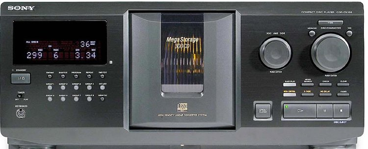
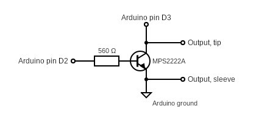

# DiscogsApp

Arduino Yun program to send commands to a Sony CDP-CX jukebox via the S-Link protocol

Commands are sent from a PC to the Arduino Yun (or Seeeduino Cloud or any OpenWRT+Arduino combo).

This project was generated with [Angular CLI](https://github.com/angular/angular-cli) version 16.2.9.

# Interface
You need to connect some components to your Arduino:

Use a 3.5 mm mono plug to connect the Arduino to the S-Link/Control A1 port of the Sony equipment and connect the Arduino to a USB port in your computer for power and serial communication.

Use the serial port to send commands to the Sony equipment. Commands are sent as lines of hexadecimal data.

Connect the interface to one of the Control-A1 ports, using a 3.5mm mono male jack.

## Development server

#### FRONTEND
Run `ng serve` for a dev server. Navigate to `http://localhost:4200/`. The application will automatically reload if you change any of the source files.

#### BACKEND
Run `cd ./server`, then run `python -m flask run --no-debugger --no-reload --host=0.0.0.0`

## Code scaffolding

Run `ng generate component component-name` to generate a new component. You can also use `ng generate directive|pipe|service|class|guard|interface|enum|module`.

## Build

Run `ng build` to build the project. The build artifacts will be stored in the `dist/` directory.

## Running unit tests

Run `ng test` to execute the unit tests via [Karma](https://karma-runner.github.io).

## Running end-to-end tests

Run `ng e2e` to execute the end-to-end tests via a platform of your choice. To use this command, you need to first add a package that implements end-to-end testing capabilities.

## Further help

To get more help on the Angular CLI use `ng help` or go check out the [Angular CLI Overview and Command Reference](https://angular.io/cli) page.
