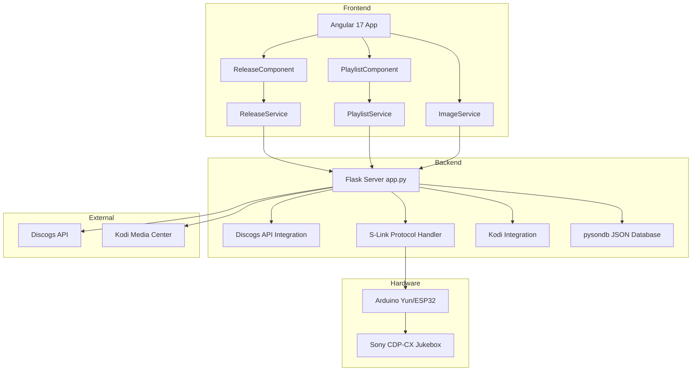
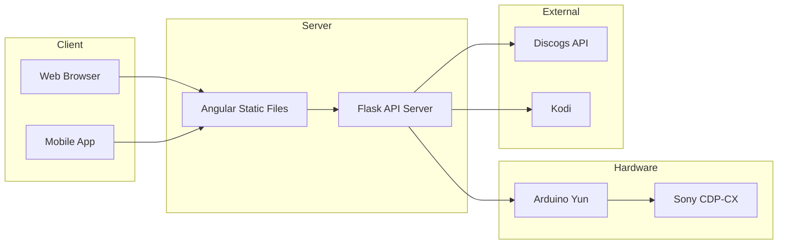

# DiscogsApp - AI Agentic Development Plan

## Project Overview

**DiscogsApp** is a hybrid Angular + Flask application that controls a Sony CDP-CX CD jukebox via the S-Link protocol. It integrates with the Discogs API for music metadata and Kodi for music video playback.

### Architecture Diagram



## Project Structure

```
DiscogsApp/
├── src/                          # Angular frontend
│   ├── app/
│   │   ├── dao/track.ts          # Data models (Artist, Track, Playlist)
│   │   ├── playlist/             # Playlist component & service
│   │   ├── release/              # Release browser component & service
│   │   ├── image.service.ts      # Image download service
│   │   ├── app.module.ts         # Main Angular module
│   │   └── app.module.server.ts  # SSR module
│   ├── environments/
│   │   ├── environment.ts        # Dev config (serviceUrl: http://127.0.0.1:5000)
│   │   └── environment.prod.ts   # Production config
│   └── assets/                   # Static assets
│
├── server/                       # Flask backend
│   ├── app.py                    # Main Flask application (1155 lines)
│   ├── requirements.txt          # Python dependencies
│   ├── discogs_data_all.json     # Main database (472,866 lines)
│   ├── playlists.json            # Playlist storage
│   ├── video_offsets.json        # Video offset data
│   ├── downloaded_images/        # Cached album artwork
│   └── .env                      # Environment variables (DISCOGS_TOKEN, etc.)
│
├── arduino_yun/                  # Arduino Yun firmware
│   ├── arduino/sony_slink/       # Arduino sketch
│   └── openwrt/server.py         # OpenWRT Python server
│
├── esp32/                        # ESP32 alternative firmware
│   └── arduino/sony_slink_esp32/
│
├── platforms/                    # Cordova platforms
├── plugins/                      # Cordova plugins
├── resources/                    # Mobile app resources
└── downloaded_images/            # Root level image cache
```

## Database Analysis

### discogs_data_all.json
- **Size**: 472,866 lines (approximately 50-100 MB based on JSON structure)
- **Format**: JSON array wrapped in `{"data": [...]}`
- **Schema** (per release entry):
  ```typescript
  {
    id: number,                    // Internal DB ID
    status: string,                // "Accepted"
    year: number,                  // Release year
    resource_url: string,          // Discogs API URL
    uri: string,                   // Discogs web URL
    artists: Artist[],             // Array of artists
    artists_sort: string,          // Sortable artist string
    labels: Label[],               // Record labels
    genres: string[],              // Music genres
    styles: string[],              // Music styles
    tracklist: Track[],            // Track listing
    released_formatted: string,    // Release date
    format_quantity: number,       // Number of discs
    deck_number: number,           // Jukebox deck (1 or 2)
    cd_position: number,           // CD slot position (1-300)
    title: string,                 // Release title
    images: Image[]                // Album artwork URLs
  }
  ```

### Track Schema
```typescript
interface Track {
  position: string;        // Track position (e.g., "1", "1-1" for multi-disc)
  type_: string;           // Track type
  artist: string;          // Track artist
  artists: Artist[];       // Track artists array
  title: string;           // Track title
  duration: string;        // Duration (e.g., "3:45")
  cd_position: number;     // CD position
  full_name: string;       // Full artist - title string
  deck_number: number;     // Deck number
  _score?: number;         // Favorite flag (0 or 1)
}
```

## API Endpoints

### Backend (Flask - Port 5000)

| Method | Endpoint | Description |
|--------|----------|-------------|
| GET | `/releases` | Get all releases from database |
| GET | `/favourite` | Get tracks with high score (favorites) |
| POST | `/favourite` | Add track to favorites |
| GET | `/playlists` | Get all playlists + favorites |
| POST | `/save-playlist` | Save/update a playlist |
| POST | `/playlist` | Send playlist to S-Link device |
| POST | `/track` | Send single track to S-Link device |
| POST | `/download-image` | Download/cache album artwork |
| POST | `/import-csv` | Import releases from CSV |
| GET | `/images/<filename>` | Serve cached images |
| POST | `/webhook` | Receive playback status updates |
| GET | `/load_music_videos` | Load music videos from Kodi |

### External APIs
- **Discogs API**: `https://api.discogs.com/releases/{id}` (rate limited: 55 calls/60s)
- **Kodi JSON-RPC**: `http://{kodi_ip}:8080/jsonrpc`
- **Kodi WebSocket**: `ws://{kodi_ip}:9090/jsonrpc`
- **S-Link Server**: Configurable via `SONY_SLINK_SERVER` env var

## Key Features

### 1. CD Browser
- Carousel-based navigation through CD collection
- Grid search view with autocomplete
- Deck/CD position tracking (supports 300+ CDs across 2 decks)
- Keyboard navigation (arrow keys)

### 2. Playlist Management
- Drag-and-drop track reordering
- Save/load named playlists
- Add tracks from release view
- Play single tracks or full playlists

### 3. Favorites System
- Star rating for tracks
- Dedicated favorites playlist
- Persistent storage in database

### 4. S-Link Protocol Integration
- Hex-based command protocol for Sony CDP-CX
- Support for multi-deck configurations
- CD position encoding (handles positions > 100 with hex conversion)
- Duration tracking for playback synchronization

### 5. Kodi Integration
- Music video library synchronization
- Automatic video matching by artist/title
- Video offset management for precise playback
- WebSocket connection for real-time status

### 6. Image Caching
- Automatic download from Discogs
- Local filesystem caching
- Default image fallback
- Filename normalization (handles special characters)

## Technology Stack

### Frontend
- **Angular 17.2.1** with TypeScript 5.2
- **Ionic 7.7.2** for mobile/cross-platform
- **CoreUI 4.7** for UI components
- **Angular Material 17.2** for Material Design components
- **ng-bootstrap 16.0** for Bootstrap components
- **PapaParse 5.4** for CSV parsing
- **RxJS 7.8** for reactive programming

### Backend
- **Flask 3.0.0** web framework
- **Flask-CORS 4.0.0** for cross-origin support
- **pysondb 1.6.7** JSON database
- **requests 2.31.0** HTTP client
- **Pillow** image processing
- **python-dotenv 1.0.0** environment management
- **ratelimit 2.2.1** API rate limiting
- **websocket-client** Kodi communication
- **gevent** async support

### Hardware
- **Arduino Yun** or **ESP32** microcontroller
- **OpenWRT** Linux server on Arduino
- **Sony S-Link/Control A1** protocol interface
- **3.5mm mono jack** connection to Sony equipment

## Development Tasks

### High Priority

- [ ] **Task 1**: Database Optimization
  - Convert JSON database to SQLite for better performance
  - Implement indexing on frequently queried fields (release_id, cd_position, deck_number)
  - Add migration scripts for existing data

- [ ] **Task 2**: API Error Handling
  - Implement comprehensive error handling for Discogs API failures
  - Add retry logic with exponential backoff
  - Cache API responses to reduce rate limit impact

- [ ] **Task 3**: Frontend State Management
  - Implement proper state management (NgRx or Signals)
  - Reduce direct HTTP calls in components
  - Add loading states and error handling

### Medium Priority

- [ ] **Task 4**: TypeScript Type Safety
  - Create proper interfaces for all API responses
  - Remove `any` types throughout the codebase
  - Add strict null checks

- [ ] **Task 5**: Testing Infrastructure
  - Add unit tests for Angular services
  - Add integration tests for Flask endpoints
  - Set up CI/CD pipeline

- [ ] **Task 6**: Code Refactoring
  - Extract S-Link protocol logic into separate module
  - Create proper service layer for business logic
  - Implement dependency injection properly

### Low Priority

- [ ] **Task 7**: Documentation
  - Add JSDoc comments to TypeScript code
  - Add docstrings to Python code
  - Create API documentation (OpenAPI/Swagger)

- [ ] **Task 8**: Performance Optimization
  - Implement lazy loading for Angular modules
  - Add pagination to release list
  - Optimize image loading

- [ ] **Task 9**: Security Improvements
  - Move DISCOGS_TOKEN to secure storage
  - Implement proper CORS configuration
  - Add input validation on all endpoints

## Code Quality Issues Identified

### Frontend (Angular)

1. **Type Safety Issues**
   - Extensive use of `any` type in components
   - Missing interfaces for API responses
   - Location: [`release.component.ts`](src/app/release/release.component.ts:25-26)

2. **Component Architecture**
   - ReleaseComponent is too large (288 lines)
   - Missing separation of concerns
   - Location: [`release.component.ts`](src/app/release/release.component.ts)

3. **Service Layer**
   - Services are well-structured but lack error handling
   - Location: [`release.service.ts`](src/app/release/release.service.ts)

### Backend (Flask)

1. **Code Organization**
   - Single file application (1155 lines)
   - Location: [`app.py`](server/app.py)

2. **Database Access**
   - Direct database calls throughout routes
   - No data access layer abstraction
   - Location: Multiple endpoints in [`app.py`](server/app.py)

3. **Error Handling**
   - Inconsistent error handling patterns
   - Some routes lack proper validation
   - Location: [`/import-csv`](server/app.py:127-196)

4. **Configuration**
   - Hardcoded values (KODI_IP, KODI_PORT)
   - Should be moved to environment variables
   - Location: [`app.py`](server/app.py:76-78)

## Deployment Architecture



## Environment Variables

Required in `server/.env`:
```env
DISCOGS_TOKEN=your_discogs_personal_access_token
SONY_SLINK_SERVER=http://arduino-yun-ip/slink
FRONTEND=http://localhost:4200
TV_API=http://kodi-ip:8080
TV_API_HTTP=http://kodi-ip:8080
KODI_USER=username
KODI_PASSWORD=password
```

## Development Setup

### Prerequisites
- Node.js 18+ and npm
- Python 3.8+
- Angular CLI 17+
- Discogs API token

### Frontend Setup
```bash
npm install
npm start  # Runs on http://localhost:4200
```

### Backend Setup
```bash
cd server
python -m venv .venv
source .venv/bin/activate  # or .venv\Scripts\activate on Windows
pip install -r requirements.txt
python app.py  # Runs on http://0.0.0.0:5000
```

### Hardware Setup
1. Connect Arduino Yun to computer via USB
2. Upload sketch from `arduino_yun/arduino/sony_slink/`
3. Copy `arduino_yun/openwrt/server.py` to Arduino Yun
4. Connect 3.5mm mono jack to Sony Control A1 port

## Future Enhancements

1. **Mobile App**: Complete Ionic/Cordova implementation
2. **Voice Control**: Integrate with voice assistants
3. **Multi-room Audio**: Support for multiple zones
4. **Streaming Integration**: Spotify, Tidal integration
5. **Analytics**: Listening history and statistics
6. **Backup/Restore**: Database backup functionality
7. **User Management**: Multi-user support with preferences
